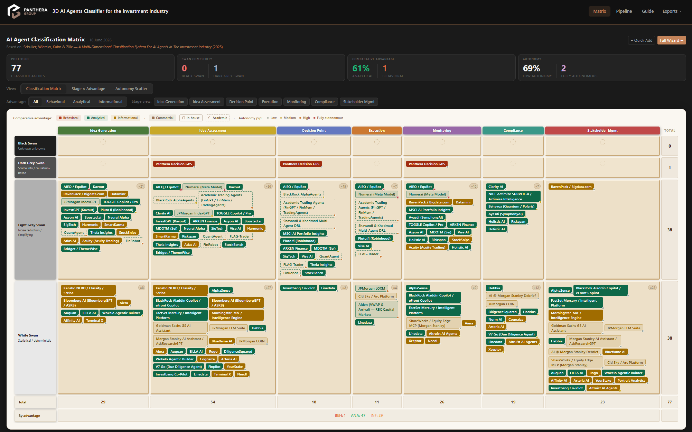

# Panthera AI Agent Classifier

A web application for cataloguing, classifying, and exporting AI agents used in investment management, built around a peer-reviewed multi-dimensional classification framework.

[Explore the app](https://panthera-ai-classification-matrix.up.railway.app)
---

## Academic Foundation

This system implements the taxonomy introduced in:

> **Schuller, B., Wierckx, T., Kuhn, M., & Zilic, I.** (2025). *A Multi-Dimensional Classification System For AI Agents In The Investment Industry*. SSRN Working Paper #6290078.
> [https://papers.ssrn.com/sol3/papers.cfm?abstract_id=6290078](https://papers.ssrn.com/sol3/papers.cfm?abstract_id=6290078)

The paper argues that the proliferation of AI systems in asset management demands a principled framework — one that captures not only *what* an agent does but *how* it behaves epistemically, where it intervenes in the investment workflow, and what class of competitive advantage it confers. The authors propose four orthogonal dimensions that together uniquely position any AI system within the investment landscape.

### Swan Theory

The complexity dimension adapts Nassim Nicholas Taleb's *Black Swan* theory (2007) into an operational four-tier taxonomy calibrated to investment decision-making. The central question is whether the **probability distribution of outcomes** can be meaningfully characterized — a distinction traceable through Knight's (1921) risk/uncertainty dichotomy and Keynes's (1921) treatment of non-quantifiable probability.

| Tier | Label | Epistemic Status |
|---|---|---|
| ◻ White Swan | Well-characterized | Distribution fully known and stable — pure optimization domain |
| ◫ Light-Grey Swan | Discoverable | Distribution exists but must be found via ML — non-stationary, fat-tailed |
| ▪ Dark-Grey Swan | Understood but unmodellable | Causal structure known; full causal chain cannot be parametrized |
| ◼ Black Swan | Unknowable | No reference distribution exists; structurally unprecedented |

---

## Screenshot



*The classification matrix maps 77 AI agents across 7 investment process stages and 4 Swan Theory complexity tiers. Each badge encodes three independent dimensions: fill/border color (comparative advantage), border style (agent type), and autonomy pip (level of human oversight).*

> **To update this screenshot**: run the app (`python app.py`), navigate to `http://localhost:5000`, and save a capture to `docs/screenshots/matrix.png`.

---

## Features

### Classification Matrix (`/`)
- **3D cube matrix** — Complexity tiers (rows) × Investment process stages (columns), populated with colour-coded agent badges
- **Three-channel badge encoding** — fill/border color = comparative advantage (orange/green/rust), border style = agent type (solid/outlined/dashed), bottom-right pip = autonomy level (grey/amber/orange/crimson-pulsing)
- **Fully Autonomous tier** — fourth autonomy level with a pulsing crimson pip for systems with no human veto on individual decisions (e.g. AIEQ, Numerai)
- **Advantage filter** — live client-side filter to isolate informational / analytical / behavioral agents
- **Hover cards** — rich tooltip on badge hover showing name, description, all classification dimensions, and stage list
- **Dashboard stats** — live counts for classified agents, complexity distribution, agent type split, and stage coverage

### Autonomy Scatter Plot (`/` → toggle)
- **Gantt-style bar chart** — each agent rendered as a horizontal bar spanning its covered investment stages
- **Y-axis** = autonomy tier (Fully Autonomous → High → Medium → Low, top to bottom)
- **Solid segments** for contiguous stage coverage; **dashed bridges** for non-adjacent stages
- **In-bar labels** colored by comparative advantage; click any bar to navigate to the agent profile

### Agent Pipeline (`/pipeline`)
- **Lifecycle table** — all agents with status, type, complexity, advantage, autonomy, and stage coverage at a glance
- **Status filter** — view pending / classified / rejected agents independently
- **Quick-add** — add a new agent by name and URL only (creates a `pending` record instantly)
- **Reject / Restore / Delete** — full lifecycle management from the table

### Agent Finder — 4-Step Questionnaire (`/guide`)
- **Progressive questionnaire** — 4 steps: investment stage → comparative advantage → autonomy level → complexity tier
- **Client-side filtering** — all agent data embedded at page load; no round-trips per filter step
- **Result cards** — sorted by stage-overlap count, each card shows classification dims, key features, and a link to the full profile
- **Auto-advance** — steps 2–4 advance automatically on radio selection for fast navigation

### 4-Step Classification Wizard (`/add`, `/edit/<id>`, `/agents/<id>/classify`)
- **Unified wizard** — same 4-step interface for adding, editing, and classifying agents
- **Session-backed draft** — `session['wizard_draft']` persists across steps; no partial database writes
- **Step 1** — name, URL, description, agent type
- **Step 2** — investment process stages (checkboxes, ≥1 required)
- **Step 3** — complexity tier, comparative advantage, autonomy (visual radio cards)
- **Step 4** — structured rationale (6 framework-keyed fields) + key features (3–6 repeating inputs)

### Agent Detail Page (`/agents/<id>`)
- **Hero header** — agent name, status/type badges, URL, creation date
- **Description + features** — full technical summary and bullet-point feature list
- **Sticky classification sidebar** — large visual metric blocks per classification axis with rationale text
- **Stage pills** — all covered investment stages rendered as colored chips

### AI Auto-Classifier (`auto_classify.py`)
- **Claude-powered** — uses `claude-opus-4-8` with tool-forced structured output
- **Batch classification** — classifies all `pending` agents in a single run
- **Instant add** — `auto_classify.py add "Agent Name" --url https://...` adds and classifies in one step
- **Full Swan Theory system prompt** — Claude receives the complete framework and returns a validated JSON object for all classification fields
- **Review workflow** — classified results flagged for human review in the pipeline view

### Export Engine (`/export/`)

| Format | Route | Contents |
|---|---|---|
| Excel | `/export/excel` | Sheet 1: complexity × stage matrix; Sheet 2: tabular agent details; Sheet 3: summary statistics. Colour-coded cells, hyperlinks, frozen panes. |
| Word | `/export/word` | Cover page → TOC → per-agent sections (4-column header, 6-row classification table, key features, stage timeline) |
| PDF | `/export/pdf` | Same structure as Word, ReportLab-rendered with internal links |

Exports include **classified agents only** — pending and rejected agents are excluded.

### REST API (`/api/agents`)
- JSON array of all agents with all fields
- Suitable for downstream dashboards, scripts, or integrations

---

## Agent Catalogue

The live database contains **77 classified agents** spanning commercial products, in-house systems, and academic prototypes. Representative entries include:

**Fully Autonomous** — AIEQ/EquBot · Numerai Meta Model

**Commercial** — RavenPack · Kensho · AlphaSense · Dataminr · BlackRock Aladdin Copilot · BlackRock AlphaAgents · BloombergGPT/ASKB · FactSet Mercury · Morningstar Mo · Goldman Sachs AI Assistant · JPMorgan LLM Suite · JPMorgan LOXM · Morgan Stanley AI Assistant · Morgan Stanley Debrief · Hebbia · NICE Actimize SURVEIL-X · Behavox · Kavout K-Score · Clarity AI · MSCI AI Portfolio Insights · TOGGLE Copilot · Portrait Analytics · Terminal X · Bridget/ThemeWise · ARKEN Finance · Aiden · Blueflame AI · IndexGPT/COIN · ShareWorks/Equity Edge · Citi Sky/Arc · InvestGPT · Pluto.fi

**In-House** — Panthera Decision GPS · Goldman Sachs AI Assistant · JPMorgan LOXM · Ayasdi

**Academic** — FinGPT/FinMem · Shavandi & Kuhn Multi-Agent DRL · and more

---

## Tech Stack

| Layer | Technology |
|---|---|
| Web framework | Flask |
| ORM / DB | SQLAlchemy + SQLite |
| Frontend | Bootstrap 5.3.3 + vanilla JS |
| AI auto-classifier | Anthropic Claude API (`claude-opus-4-8`) |
| Excel export | openpyxl |
| Word export | python-docx |
| PDF export | ReportLab |

---

## Installation

```bash
git clone <repo-url>
cd AI_classification/ai_agent_classifier
pip install flask flask-sqlalchemy python-docx openpyxl reportlab anthropic
```

**Optional — for AI auto-classification:**
```bash
# Windows
set ANTHROPIC_API_KEY=sk-ant-...

# macOS / Linux
export ANTHROPIC_API_KEY=sk-ant-...
```

---

## Running the Application

```bash
cd ai_agent_classifier
python app.py
```

Navigate to `http://localhost:5000`. The SQLite database is created automatically on first run.

**Seed the catalogue** (77 pre-classified agents):
```bash
python build_agents_db.py
```

---

## Auto-Classification

```bash
# Classify all pending agents
python auto_classify.py

# Add a new agent and classify immediately
python auto_classify.py add "Agent Name" --url https://example.com
```

See [CLASSIFICATION_GUIDE.md](CLASSIFICATION_GUIDE.md) for the full Swan Theory framework and classification decision heuristics.

---

## File Structure

```
AI_classification/
├── README.md
├── CLAUDE.md                          ← developer context for AI tooling
├── DEV_LOG.md                         ← rolling development log
├── CLASSIFICATION_GUIDE.md            ← Swan Theory framework + classification guide
└── ai_agent_classifier/
    ├── app.py                         ← Flask routes + session wizard
    ├── models.py                      ← SQLAlchemy Agent model
    ├── auto_classify.py               ← Claude API batch classifier
    ├── exports.py                     ← Excel / Word / PDF export engine
    ├── build_agents_db.py             ← seeds 77 pre-classified agents
    ├── requirements.txt
    ├── instance/
    │   └── agents.db                  ← SQLite database
    ├── static/
    │   ├── css/style.css              ← design system (CSS custom properties)
    │   ├── js/app.js                  ← Bootstrap tooltip init + flash dismiss
    │   └── img/                       ← Panthera logo
    └── templates/
        ├── base.html                  ← master layout
        ├── matrix.html                ← classification matrix + autonomy scatter
        ├── pipeline.html              ← agent lifecycle table
        ├── wizard.html                ← 4-step classification wizard
        ├── agent_detail.html          ← per-agent profile
        └── guide.html                 ← Agent Finder questionnaire
```

---

## References

- Schuller, B., Wierckx, T., Kuhn, M., & Zilic, I. (2025). *A Multi-Dimensional Classification System For AI Agents In The Investment Industry*. SSRN #6290078.
- Taleb, N. N. (2007). *The Black Swan: The Impact of the Highly Improbable*. Random House.
- Knight, F. H. (1921). *Risk, Uncertainty and Profit*. Houghton Mifflin.
- Keynes, J. M. (1921). *A Treatise on Probability*. Macmillan.

---

*Built for the Panthera Group · Classification methodology © Schuller, Wierckx, Kuhn & Zilic (2025)*
