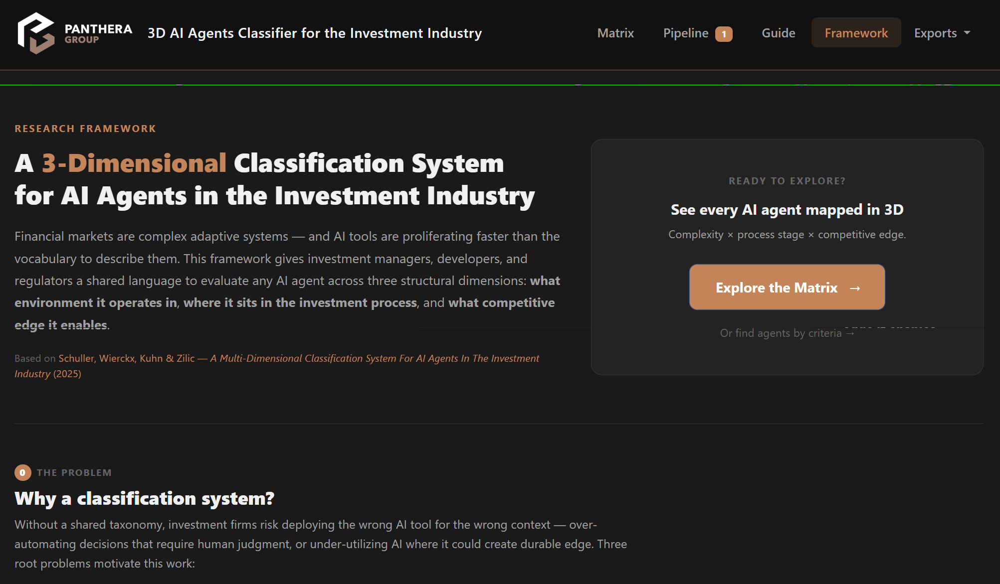
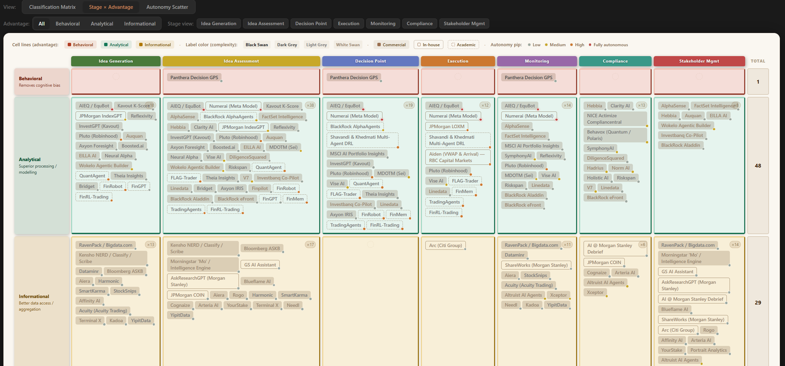
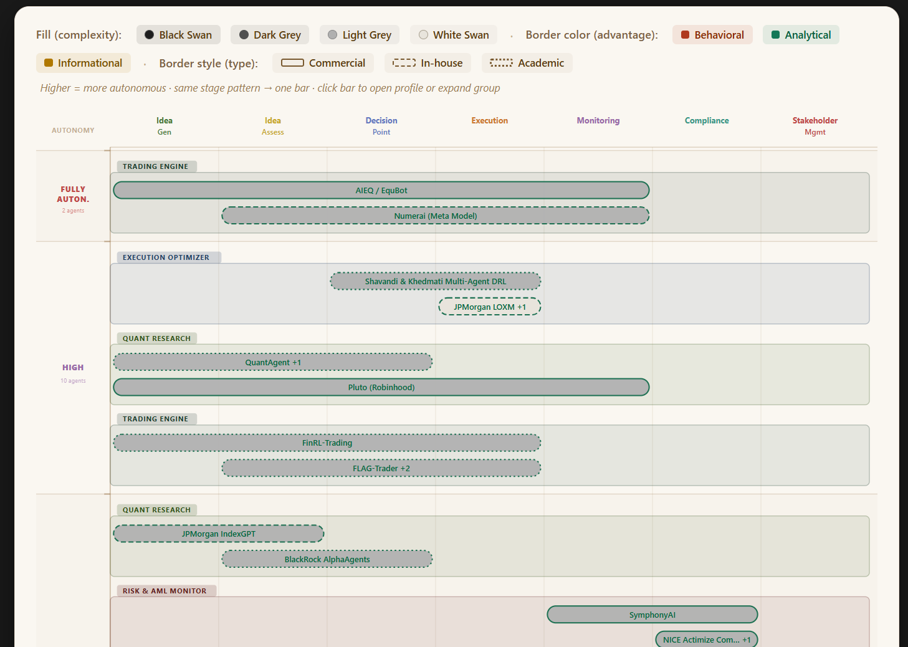
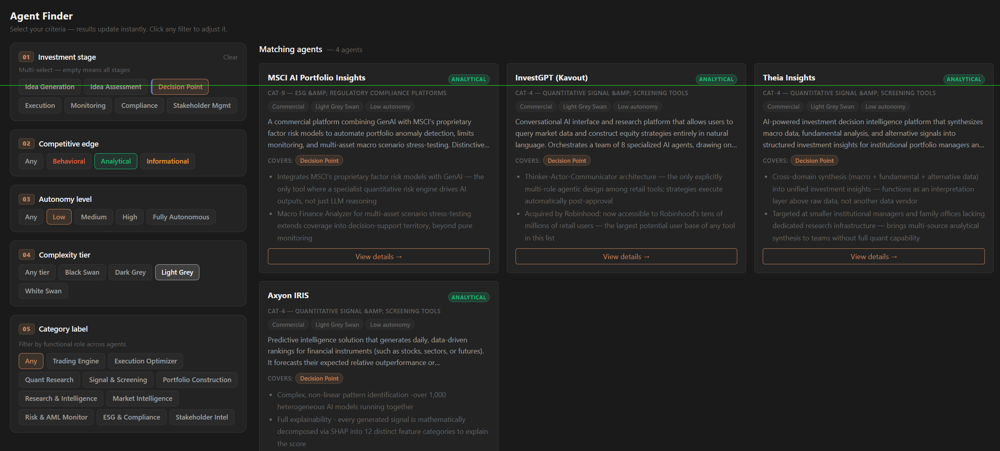
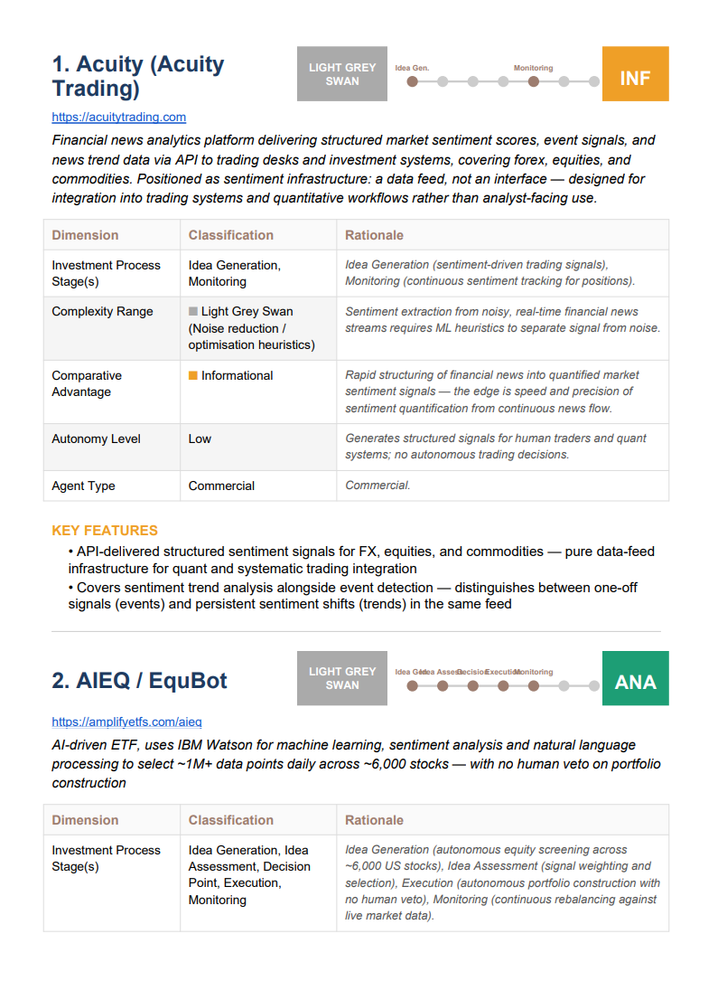

# Panthera AI Agent Classifier

A web application for cataloguing, classifying, and exporting AI agents used in investment management, built around a peer-reviewed multi-dimensional classification framework — and for benchmarking your own firm's AI tool stack against it via the [Enterprise Stack](#enterprise-stack-enterprise) page.

[Explore the app](https://panthera-ai-classification-matrix.up.railway.app)


---

## Academic Foundation

This system implements the taxonomy introduced in:

> **Schuller, B., Wierckx, T., Kuhn, M., & Zilic, I.** (2025). *A Multi-Dimensional Classification System For AI Agents In The Investment Industry*. SSRN Working Paper #6290078.
> [https://papers.ssrn.com/sol3/papers.cfm?abstract_id=6290078](https://papers.ssrn.com/sol3/papers.cfm?abstract_id=6290078)

The paper argues that the proliferation of AI systems in asset management demands a principled framework — one that captures not only *what* an agent does but *how* it behaves epistemically, where it intervenes in the investment workflow, and what class of competitive advantage it confers. The authors propose four orthogonal dimensions that together uniquely position any AI system within the investment landscape.

### Swan Theory

The complexity dimension adapts Nassim Nicholas Taleb's *Black Swan* theory (2007) into an operational four-tier taxonomy calibrated to investment decision-making. The central question is whether the **probability distribution of outcomes** can be meaningfully characterized — a distinction traceable through Knight's (1921) risk/uncertainty dichotomy and Keynes's (1921) treatment of non-quantifiable probability.

| Tier | Label | Epistemic Status |
|---|---|---|
| ◻ White Swan | Well-characterized | Distribution fully known and stable — pure optimization domain |
| Light-Grey Swan | Discoverable | Distribution exists but must be found via ML — non-stationary, fat-tailed |
| Dark-Grey Swan | Understood but unmodellable | Causal structure known; full causal chain cannot be parametrized |
| ◼ Black Swan | Unknowable | No reference distribution exists; structurally unprecedented |

---

## Screenshots


*The classification matrix maps 78 classified AI agents across 7 investment process stages and 4 Swan Theory complexity tiers. Each badge encodes three independent dimensions: fill/border color (comparative advantage), border style (agent type), and autonomy pip (level of human oversight).*

| Framework landing page | Stage × Advantage view |
|---|---|
|  |  |

| Autonomy Scatter | Agent Finder (Guide) |
|---|---|
|  |  |

*PDF export sample:* 

> **To refresh a screenshot**: run the app (`python app.py`), navigate to the relevant page, and overwrite the matching file in `docs/screenshots/`.

---

## Features

### Framework Landing Page (`/`, `/framework`)
- **Five-dimension explainer** — complexity, process stage, comparative advantage, autonomy, and product type, framed as one coordinate system
- **Category Cluster section** — the 10 functional categories (CAT-1…CAT-10) explained as cross-cutting lenses over the 5 dimensions
- **Animated CTA** — pulsing "Explore the Matrix" button linking through to `/matrix`

### Classification Matrix (`/matrix`) — 3 toggleable views
- **Classification Matrix** — Complexity tiers (rows) × Investment process stages (columns), populated with colour-coded agent badges in a 3D-cube-styled widget
- **Stage × Advantage** — same agents pivoted by comparative advantage (informational / analytical / behavioral) instead of complexity
- **Autonomy Scatter** — Gantt-style bar chart; Y-axis = autonomy tier (Fully Autonomous → High → Medium → Low), solid segments for contiguous stage coverage, dashed bridges for non-adjacent stages, in-bar labels colored by comparative advantage, click any bar to navigate to the agent profile
- **Three-channel badge encoding** — fill/border color = comparative advantage (orange/green/rust), border style = agent type (solid/outlined/dashed), bottom-right pip = autonomy level (grey/amber/orange/crimson-pulsing)
- **Fully Autonomous tier** — fourth autonomy level with a pulsing crimson pip for systems with no human veto on individual decisions (e.g. AIEQ, Numerai)
- **Advantage filter** — live client-side filter to isolate informational / analytical / behavioral agents
- **Hover cards** — rich tooltip on badge hover showing name, description, all classification dimensions, and stage list
- **Dashboard stats** — live counts for classified agents, complexity distribution, agent type split, and stage coverage
- **Contextual help** — a "?" icon next to every complexity tier and process stage opens a plain-language explanation (definition + example), no framework knowledge required

### Agent Pipeline (`/pipeline`)
- **Lifecycle table** — all agents with status, type, complexity, advantage, autonomy, category, and stage coverage at a glance
- **Status filter** — view pending / classified / rejected agents independently
- **Quick-add** — add a new agent by name and URL only (creates a `pending` record instantly)
- **Reject / Restore / Delete** — full lifecycle management from the table
- **Column tooltips** — "?" icons on Stage(s), Complexity, and Autonomy headers explain each dimension without leaving the table

### Agent Finder — 5-Step Questionnaire (`/guide`)
- **Progressive questionnaire** — 5 steps: investment stage → comparative advantage → autonomy level → complexity tier → category label
- **Client-side filtering** — all agent data embedded at page load; no round-trips per filter step
- **Result cards** — sorted by stage-overlap count; each card shows classification dims, category label, key features, a link to the full profile, and an external "open tool" link when a URL is set
- **Auto-advance** — steps 2–5 advance automatically on radio/chip selection for fast navigation
- **Chip tooltips** — hover any stage, autonomy, or complexity chip for a one-line definition

### Enterprise Stack (`/enterprise`)
Turns the catalogue into a personal benchmarking tool: mark which AI tools your own firm actually runs, see exactly where the coverage gaps are, and get pointed at commercial tools that would close them.
- **Tool picker** — a searchable, checkbox-driven table of every catalogue agent, defaulting to a **"Commercial only" filter** (one click removes it, one click re-applies it) since in-house and academic tools aren't something you can simply go acquire
- **Custom tools** — not in the catalogue? Add one by name + URL; it lands in the Pipeline to be classified later so it can join the coverage map
- **Benchmark coverage map** — the same Complexity × Stage cartography as the main Matrix, populated only with your selected tools
- **"Find solutions" gap search** — every empty cell on *your* map shows a button listing catalogue tools (not yet in your stack) that would fill it, with a one-click add — or a plain "no tool yet" note if the catalogue has no answer either
- **Recommended additions** — up to 6 commercial-only tools, ranked by how many of your coverage gaps each one would close
- **Two ways to add a tool** — "+ Add with full details" keeps the catalogue's existing description and classification; "Add name & link only" creates a bare placeholder you classify yourself later, without inheriting the catalogue's opinion of it
- **Stack composition charts** — plain agent counts per process stage, complexity tier, autonomy level, and comparative advantage (not a percentage of the wider catalogue)

### 4-Step Classification Wizard (`/add`, `/edit/<id>`, `/agents/<id>/classify`)
- **Unified wizard** — same 4-step interface for adding, editing, and classifying agents
- **Session-backed draft** — `session['wizard_draft']` persists across steps; no partial database writes
- **Step 1** — name, URL, description, agent type, category label
- **Step 2** — investment process stages (checkboxes, ≥1 required)
- **Step 3** — complexity tier, comparative advantage, autonomy (visual radio cards) — each option carries a "?" tooltip
- **Step 4** — structured rationale (6 framework-keyed fields) + key features (3–6 repeating inputs)

### Agent Detail Page (`/agents/<id>`)
- **Hero header** — agent name, status/type badges, URL, creation date
- **Description + features** — full technical summary and bullet-point feature list
- **Sticky classification sidebar** — large visual metric blocks per classification axis, category label + description, with rationale text
- **Stage pills** — all covered investment stages rendered as colored chips

### Admin Panel (`/admin`)
- **Flask-Admin CRUD** — searchable, filterable list view over the full `agents` table
- **Dropdowns for every enum field** (status, advantage, complexity, autonomy, agent_type, category) instead of raw text inputs
- **JSON validation** on save for the three JSON columns (`stages`, `key_features`, `rationale`)
- **No authentication** — intended for local/internal use only; see Known Issues in `docs/DEV_LOG.md`

### AI Auto-Classifier (`auto_classify.py`)
- **Claude-powered** — uses `claude-opus-4-8` with tool-forced structured output
- **Batch classification** — classifies all `pending` agents in a single run
- **Instant add** — `auto_classify.py add "Agent Name" --url https://...` adds and classifies in one step
- **Full Swan Theory system prompt** — Claude receives the complete framework and returns a validated JSON object for all classification fields
- **Review workflow** — classified results flagged for human review in the pipeline view

### Export Engine (`/export/`)

| Format | Route | Contents |
|---|---|---|
| Excel | `/export/excel` | Sheet 1: complexity × stage matrix; Sheet 2: tabular agent details; Sheet 3: summary statistics. Colour-coded cells, hyperlinks, frozen panes. |
| Word | `/export/word` | Cover page → TOC → per-agent sections (4-column header, 6-row classification table, key features, stage timeline) |
| PDF | `/export/pdf` | Same structure as Word, ReportLab-rendered with internal links |

Exports include **classified agents only** — pending and rejected agents are excluded.

### REST API (`/api/agents`)
- JSON array of all agents with all fields
- Suitable for downstream dashboards, scripts, or integrations

---

## Agent Catalogue

The live database contains **78 classified agents** (81 total tracked, including pending and rejected) spanning commercial products, in-house systems, and academic prototypes, organized into 10 functional categories (CAT-1 through CAT-10 — see [CLASSIFICATION_GUIDE.md](docs/CLASSIFICATION_GUIDE.md#4a-category-label)). Representative entries include:

**Fully Autonomous** — AIEQ/EquBot · Numerai Meta Model

**Commercial** — RavenPack · Kensho · AlphaSense · Dataminr · BlackRock Aladdin Copilot · BlackRock AlphaAgents · BloombergGPT/ASKB · FactSet Mercury · Morningstar Mo · Goldman Sachs AI Assistant · JPMorgan LLM Suite · JPMorgan LOXM · Morgan Stanley AI Assistant · Morgan Stanley Debrief · Hebbia · NICE Actimize SURVEIL-X · Behavox · Kavout K-Score · Clarity AI · MSCI AI Portfolio Insights · TOGGLE Copilot · Portrait Analytics · Terminal X · Bridget/ThemeWise · ARKEN Finance · Aiden · Blueflame AI · IndexGPT/COIN · ShareWorks/Equity Edge · Citi Sky/Arc · InvestGPT · Pluto.fi

**In-House** — Panthera Decision GPS · Goldman Sachs AI Assistant · JPMorgan LOXM · Ayasdi

**Academic** — FinGPT/FinMem · Shavandi & Kuhn Multi-Agent DRL · and more

---

## Tech Stack

| Layer | Technology |
|---|---|
| Web framework | Flask |
| ORM / DB | SQLAlchemy — SQLite (local dev) or PostgreSQL (production, via `DATABASE_URL`) |
| Admin CRUD | Flask-Admin (`/admin`) |
| Frontend | Bootstrap 5.3.3 + vanilla JS |
| AI auto-classifier | Anthropic Claude API (`claude-opus-4-8`) |
| Excel export | openpyxl |
| Word export | python-docx |
| PDF export | ReportLab |
| Production server | gunicorn, deployed on Railway |

---

## Installation

```bash
git clone <repo-url>
cd AI_classification
pip install -r requirements.txt
```

**Optional — for AI auto-classification:**
```bash
# Windows
set ANTHROPIC_API_KEY=sk-ant-...

# macOS / Linux
export ANTHROPIC_API_KEY=sk-ant-...
```

**Optional — for a PostgreSQL backend** (e.g. mirroring the Railway deployment), `psycopg2-binary` is already in `requirements.txt`; just set `DATABASE_URL`:
```bash
set DATABASE_URL=postgresql://...   # macOS/Linux: export DATABASE_URL=...
```
Without `DATABASE_URL` set, the app falls back to local SQLite automatically.

---

## Running the Application

```bash
cd ai_agent_classifier
python app.py
```

Navigate to `http://localhost:5000`. The SQLite database is created automatically on first run.

**Seed the catalogue** (78 pre-classified agents):
```bash
python build_agents_db.py
```
Safe to re-run — it skips agents that already exist by name.

---

## Auto-Classification

```bash
# Classify all pending agents
python auto_classify.py

# Add a new agent and classify immediately
python auto_classify.py add "Agent Name" --url https://example.com
```

See [CLASSIFICATION_GUIDE.md](docs/CLASSIFICATION_GUIDE.md) for the full Swan Theory framework and classification decision heuristics.

---

## Deployment

The live instance linked above runs on **Railway**. `Procfile` defines the start command:
```
web: cd ai_agent_classifier && gunicorn app:app --bind 0.0.0.0:$PORT --workers 2
```

| Env var | Purpose |
|---|---|
| `DATABASE_URL` | Railway-provisioned PostgreSQL connection string |
| `SECRET_KEY` | Flask session secret — set this in production, or sessions reset on every restart |
| `ANTHROPIC_API_KEY` | Only needed if running `auto_classify.py` against the deployed environment |

To copy existing local SQLite data into a fresh PostgreSQL database, run `ai_agent_classifier/migrate_to_postgres.py` with `DATABASE_URL` set.

---

## File Structure

```
AI_classification/
├── README.md
├── requirements.txt                   ← pip dependencies (installed from repo root)
├── Procfile                           ← Railway/gunicorn start command
├── docs/
│   ├── CLAUDE.md                      ← developer context for AI tooling
│   ├── DEV_LOG.md                     ← rolling development log
│   ├── CLASSIFICATION_GUIDE.md        ← Swan Theory framework + classification guide
│   └── screenshots/                   ← matrix, framework, guide, autonomy, advantage, pdf_export PNGs
├── presentation/
│   ├── build_deck.py                  ← python-pptx generator for the stakeholder deck
│   └── Panthera_AI_Agent_Classifier.pptx
└── ai_agent_classifier/
    ├── app.py                         ← Flask routes + session wizard
    ├── models.py                      ← SQLAlchemy Agent model
    ├── auto_classify.py               ← Claude API batch classifier
    ├── exports.py                     ← Excel / Word / PDF export engine
    ├── build_agents_db.py             ← seeds 78 pre-classified agents (idempotent)
    ├── migrate_to_postgres.py         ← one-time SQLite → Railway PostgreSQL data copy
    ├── instance/
    │   └── agents.db                  ← SQLite database (local dev only)
    ├── static/
    │   ├── css/style.css              ← design system (CSS custom properties)
    │   ├── js/app.js                  ← Bootstrap tooltip + popover init, flash dismiss
    │   └── img/                       ← Panthera logo
    └── templates/
        ├── base.html                  ← master layout
        ├── _macros.html               ← shared Jinja macros — "?" help bubble, add-to-stack buttons
        ├── framework.html             ← landing page (`/`, `/framework`) — 5-dimension explainer
        ├── matrix.html                ← classification matrix (`/matrix`) + stage×advantage + autonomy scatter
        ├── pipeline.html              ← agent lifecycle table
        ├── enterprise.html            ← Enterprise Stack (`/enterprise`) — picker, benchmark map, recommendations
        ├── wizard.html                ← 4-step classification wizard
        ├── agent_detail.html          ← per-agent profile
        └── guide.html                 ← Agent Finder — 5-step questionnaire
```

---

## References

- Schuller, B., Wierckx, T., Kuhn, M., & Zilic, I. (2025). *A Multi-Dimensional Classification System For AI Agents In The Investment Industry*. SSRN #6290078.
- Taleb, N. N. (2007). *The Black Swan: The Impact of the Highly Improbable*. Random House.
- Knight, F. H. (1921). *Risk, Uncertainty and Profit*. Houghton Mifflin.
- Keynes, J. M. (1921). *A Treatise on Probability*. Macmillan.

---

*Built for the Panthera Group · Classification methodology © Schuller, Wierckx, Kuhn & Zilic (2025)*
